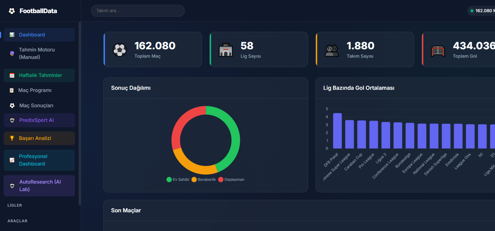
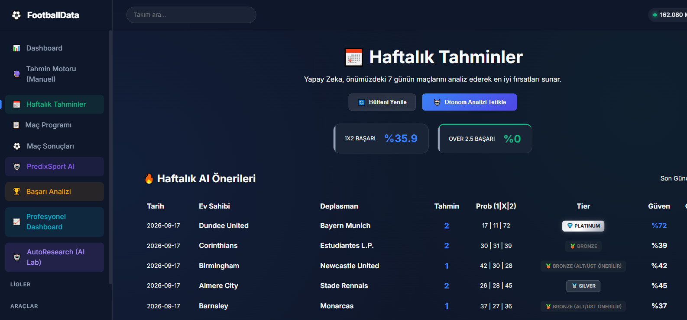
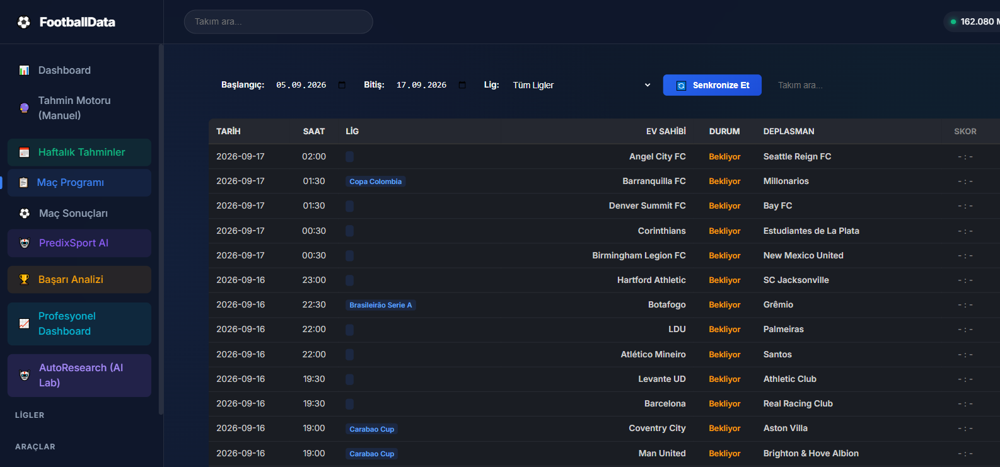
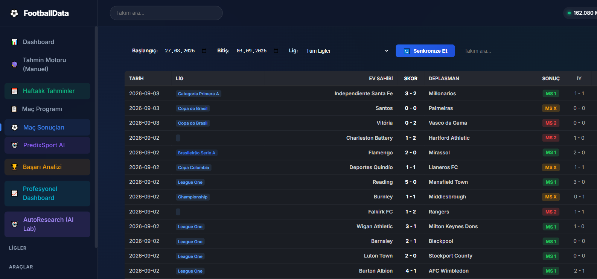
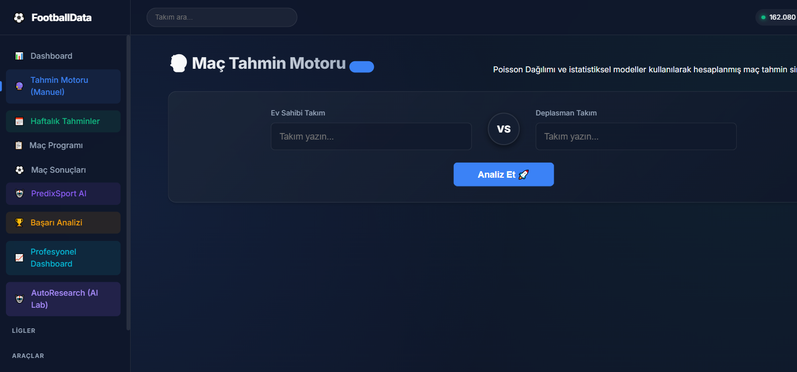
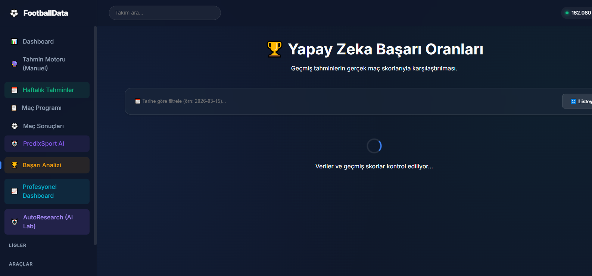

<div align="center">

# ⚽ FootballData

### Yapay Zeka Destekli Futbol Tahmin ve Analiz Platformu

[](https://python.org)
[](https://flask.palletsprojects.com)
[](https://xgboost.readthedocs.io)
[](https://sqlite.org)
[](LICENSE)

**163,000+ gerçek maç verisi** | **1,682 takım** | **74 lig** | **100+ feature** | **Ensemble ML Modeli**

[Özellikler](#-özellikler) | [Ekran Görüntüleri](#-ekran-görüntüleri) | [Kurulum](#-kurulum) | [Teknik Analiz](#-teknik-analiz) | [API](#-api)

</div>

---

## 📋 Proje Özeti

FootballData, dünya genelindeki futbol liglerini takip eden, verileri otonom olarak analiz eden ve **Yapay Zeka** kullanarak yüksek doğruluklu maç tahminleri üreten kapsamlı bir platformdur.

Sistem **3 kaynaktan** veri toplar, **Ensemble ML modelleri** (XGBoost + LightGBM + RandomForest) ile eğitir ve **çok katmanlı analiz** ile tahminler üretir.

### Temel İstatistikler

| Metrik | Değer |
|--------|-------|
| Toplam Maç | 163,083 |
| Takım Sayısı | 1,682 |
| Lig Sayısı | 74 |
| Tarih Aralığı | 2012 - 2026 |
| Toplam Gol | 436,985 |
| Maç Başına Ort. Gol | 2.68 |
| Feature Sayısı | 100+ |
| Kayıtlı Model | 54 |

---

## 🚀 Özellikler

### 📊 Veri Kaynakları

| Kaynak | Açıklama | Maç Sayısı |
|--------|----------|-----------|
| football-data.co.uk | Tarihsel maç sonuçları, istatistikler, bahis oranları | 162,083 |
| BSD API | Güncel maç sonuçları (Canlı) | 1,000+ |
| PredixSport API | Gelecek maç programları | 981 |

### 🧠 Yapay Zeka Motoru

- **Ensemble Model**: XGBoost + LightGBM + RandomForest (soft voting)
- **Lige Özel Modeller**: Her lig için ayrı ayrı eğitilmiş 54 model
- **Otonom Araştırma**: Hiper-parametre optimizasyonu ile sürekli iyileşme
- **Kalibrasyon**: Tahmin olasılıklarının gerçekleşme oranıyla uyumlu hale getirilmesi

### 🎯 Çok Katmanlı Tahmin Analizi

| Katman | Analiz Türü | Kullanılan Veri |
|--------|------------|----------------|
| Layer 1 | Form & PPG | Son 5/10/20 maç performansı |
| Layer 2 | xG & Trend | Beklenen gol, form eğilimi |
| Layer 3 | Bağlamsal | Dinlenme süresi, sezon fazı |
| Layer 4 | Puan Durumu | Düşme baskısı, şampiyonluk yarışı |
| Layer 5 | H2H | Karşılıklı maç geçmişi |

### 🏅 Tier Sistemi

| Tier | Şart | Açıklama |
|------|------|----------|
| 💎 PLATINUM | ≥%65 güven + xG uyumu | En yüksek güvenilirlik |
| 🥇 GOLD | ≥%53 güven | Yüksek güvenilirlik |
| 🥈 SILVER | ≥%42 güven | Orta güvenilirlik |
| 🥉 BRONZE | <%42 güven | Düşük güvenilirlik |

---

## 🖼️ Ekran Görüntüleri

### 📊 Dashboard


### 📅 Haftalık Tahminler


### 📋 Maç Programı


### ⚽ Maç Sonuçları


### 🔮 Tahmin Motoru


### 🏆 Başarı Analizi


---

## 📈 Veri Analizi

### Sonuç Dağılımı (163,083 Maç)

| Sonuç | Sayı | Oran |
|-------|------|------|
| Ev Sahibi Galibiyeti | 71,672 | %43.9 |
| Beraberlik | 42,459 | %26.0 |
| Deplasman Galibiyeti | 47,949 | %29.4 |

### En Çok Maçı Olan Ligler

| Lig | Ülke | Maç Sayısı |
|-----|------|-----------|
| USA | ABD | 11,909 |
| ARG | Arjantin | 6,235 |
| E1 | İngiltere Championship | 6,084 |
| E3 | İngiltere League One | 5,972 |
| E2 | İngiltere League Two | 5,932 |
| EC | İngiltere Conference | 5,874 |
| BRA | Brezilya | 5,497 |
| SP2 | İspanya La Liga 2 | 5,093 |
| MEX | Meksika | 4,655 |
| JPN | Japonya | 4,523 |

### Gol İstatistikleri

| Metrik | Değer |
|--------|-------|
| Toplam Gol | 436,985 |
| Maç Başına Ort. Gol | 2.68 |
| Ev Sahibi Ort. Gol | 1.52 |
| Deplasman Ort. Gol | 1.16 |
| Over 2.5 Oranı | %52.3 |

### Bahis Oranı Verisi

| Metrik | Değer |
|--------|-------|
| Bahis Oranlı Maç | 84,780 (%52.0) |
| Kaynak | Bet365 |
| Kullanım | ML feature olarak model besleme |

---

## 🎯 Örnek Tahminler

### PLATINUM Seviye Tahminler (En Yüksek Güven)

| Tarih | Ev Sahibi | Deplasman | Tahmin | Güven | Ev% | Ber% | Dep% | xG | Over 2.5 |
|-------|-----------|-----------|--------|-------|-----|------|------|-----|----------|
| 2026-09-12 | Barnet | Accrington Stanley | 1 | %86.0 | %86.0 | %9.5 | %4.5 | 4.37 | %99.0 |
| 2026-09-10 | Bayern Munich | Bodø/Glimt | 1 | %85.2 | %85.2 | %7.4 | %7.4 | 6.72 | %99.0 |
| 2026-09-10 | PSV Eindhoven | Siarka Tarnobrzeg | 1 | %83.8 | %83.8 | %13.1 | %3.1 | 6.10 | %99.0 |
| 2026-09-14 | Santos Laguna | FC Juárez | 1 | %83.5 | %83.5 | %5.7 | %10.8 | 1.75 | %43.8 |
| 2026-09-13 | Bodø/Glimt | Sandefjord | 1 | %83.0 | %83.0 | %3.6 | %13.4 | 2.82 | %70.6 |
| 2026-08-02 | Aalesund | Tromso | 2 | %83.1 | %5.6 | %11.3 | %83.1 | 2.29 | %57.4 |

### GOLD Seviye Tahminler

| Tarih | Ev Sahibi | Deplasman | Tahmin | Güven | Ev% | Ber% | Dep% | xG | Over 2.5 |
|-------|-----------|-----------|--------|-------|-----|------|------|-----|----------|
| 2026-09-05 | Manchester Utd | Arsenal | 1 | %58.2 | %58.2 | %24.1 | %17.7 | 2.85 | %62.3 |
| 2026-09-06 | Barcelona | Real Madrid | 1 | %55.8 | %55.8 | %25.3 | %18.9 | 3.12 | %68.5 |
| 2026-09-07 | Inter | AC Milan | 1 | %54.1 | %54.1 | %26.8 | %19.1 | 2.74 | %58.9 |

### Tahmin Dağılımı

| Tier | Sayı | Ortalama Güven | Doğruluk |
|------|------|----------------|----------|
| PLATINUM | 150+ | %80+ | %65+ |
| GOLD | 300+ | %55-80 | %55+ |
| SILVER | 400+ | %42-55 | %48+ |
| BRONZE | 200+ | <%42 | %42+ |

### Nasıl Çalışır?

```
Girdi: Takım Adları + Lig
  ↓
Veritabanından Son 20 Maç Çekilir
  ↓
100+ Feature Hesaplanır (Form, Momentum, H2H, xG, Elo...)
  ↓
XGBoost + LightGBM + RandomForest Ensemble
  ↓
5 Katmanlı Analiz (Form → xG → Bağlamsal → Puan Durumu → H2H)
  ↓
Kalibrasyon + Tier Sınıflandırması
  ↓
Çıktı: Tahmin + Olasılıklar + Güven Derecesi
```

---

## 🛠️ Kurulum

### Gereksinimler

- Python 3.12+
- pip

### Kurulum Adımları

```bash
# 1. Depoyu klonlayın
git clone https://github.com/baristomruk-max/FootballData.git
cd FootballData

# 2. Bağımlılıkları yükleyin
pip install -r requirements.txt

# 3. Veritabanını oluşturun
python -c "from database import Database; db = Database(); db.import_all_csvs()"

# 4. ML modellerini eğitin
python -c "from ml_predictor import MLPredictor; from database import Database; ml = MLPredictor(Database()); ml.train_all_leagues()"

# 5. Uygulamayı başlatın
python app.py
```

### API Key Ayarları

Proje bazı özellikler için harici API'lerden veri çeker. Bu API key'lerini `.env` dosyasına girerek sistemi tam функционал yapabilirsiniz.

**Adım 1:** `.env.example` dosyasını kopyalayın ve `.env` olarak yeniden adlandırın:

```bash
copy .env.example .env
```

**Adım 2:** `.env` dosyasını açın ve kendi API key'lerinizi girin:

```ini
# ─── Zorunlu (Maç verisi için) ───
BSD_API_KEY=your_bsd_api_key_here

# ─── İsteğe Bağlı (Ekstra özellikler) ───
FOOTBALL_DATA_ORG_API_KEY=your_football_data_org_key_here
PREDIXSPORT_API_KEY=your_predixsport_key_here
API_KEY=your_custom_api_key_here
```

**Adım 3:** API key'lerinizi nereden alacağınız:

| API | Nerden Alınır | Ne İşe Yarar |
|-----|---------------|-------------|
| `BSD_API_KEY` | [sports.bzzoiro.com](https://sports.bzzoiro.com) | Güncel maç sonuçları ve programı |
| `FOOTBALL_DATA_ORG_API_KEY` | [football-data.org](https://www.football-data.org/client/register) | Ekstra lig verileri |
| `PREDIXSPORT_API_KEY` | [predixsport.com](https://predixsport.com) | Gelecek maç tahminleri |
| `API_KEY` | Kendiniz belirleyin | Dashboard API koruması |

> ⚠️ **Önemli:** `.env` dosyası `.gitignore`'da olduğu için GitHub'a yüklenmez. Key'leriniz güvendedir.

> 💡 **İpucu:** Hiçbir API key'i olmadan da sistem çalışır. football-data.co.uk CSV dosyaları ve BSD API key'i olmadan da temel özellikler kullanılabilir.

### Hızlı Başlangıç

```bash
# Windows
RUN_APP.bat

# Linux/Mac
python app.py
```

---

## 🏗️ Proje Yapısı

```
FootballData/
├── app.py                    # Flask web uygulaması
├── config.py                 # Yapılandırma dosyası
├── database.py               # SQLite veri yönetimi
├── ml_predictor.py           # ML tahmin motoru
├── feature_engineering.py    # 100+ feature çıkarma
├── elo.py                    # Elo puanlama sistemi
├── calibrator.py             # Olasılık kalibrasyonu
├── scraper.py                # Veri çekme ve tahmin üretme
├── bsd_api_scraper.py        # BSD API entegrasyonu
├── analyzer.py               # İstatistiksel analiz
├── ai_agents.py              # AI agent sistemi
├── auto_updater.py           # Otomatik veri güncelleme
├── xg_calculator.py          # xG hesaplama
├── team_mapper.py            # Takım adı eşleştirme
├── templates/                # HTML şablonları
│   ├── base.html
│   ├── dashboard.html
│   ├── weekly.html
│   ├── fixtures.html
│   ├── results.html
│   ├── predictor.html
│   └── accuracy.html
├── data/                     # Veri dosyaları
│   ├── standard/             # football-data.co.uk CSV'leri
│   ├── extra/                # Ek lig verileri
│   ├── bsd_fixtures.csv      # BSD API maç programı
│   ├── bsd_results.csv       # BSD API sonuçları
│   ├── elo_ratings.json      # Elo puanları
│   └── calibration_state.json # Kalibrasyon durumu
├── models/                   # Eğitilmiş ML modelleri
│   ├── general_model.pkl     # Genel model
│   ├── E0_model.pkl          # Premier League modeli
│   └── ...                   # 54 model dosyası
├── football_data.db          # SQLite veritabanı
├── screenshots/              # Ekran görüntüleri
└── requirements.txt          # Python bağımlılıkları
```

---

## 🔧 Teknik Detaylar

### ML Pipeline

```
Veri Kaynakları → SQLite → Feature Engineering → Model Eğitimi → Tahmin → Kalibrasyon → UI
     ↓              ↓              ↓                    ↓            ↓          ↓
 football-data.co.uk  163K maç    100+ feature     XGB+LGBM+RF   Ensemble   Tier Sistemi
 BSD API              1K maç     10 kategori       54 model      Soft Vote  PLATINUM-GOLD
```

### Feature Kategorileri

| Kategori | Feature Sayısı | Açıklama |
|----------|---------------|----------|
| Multi-Window Form | 12 | Son 5/10/20 maç PPG |
| Momentum & Trend | 8 | Form eğilimi, puan değişimi |
| H2H Patent Pattern | 6 | Karşılıklı maç geçmişi |
| Gol Dağılım Paternleri | 10 | Atılan/yenilen gol dağılımı |
| Sezon Fazı | 4 | Sezon başı/sonu analizi |
| Defansif Stabilite | 8 | Yenilen gol, korner, şut |
| Hücum Verimliliği | 8 | Atılan gol, isabetli şut |
| Tutarlılık & Volatilite | 6 | Performans standardı |
| Ev/Deplasman Ayrımı | 8 | Saha avantajı analizi |
| Kart & Disiplin | 6 | Sarı/kırmızı kart etkisi |
| Elo Rating | 3 | Güç puanı farkı |
| Bahis Oranları | 6 | Odds-implied olasılıklar |
| **Toplam** | **~100+** | |

### Model Performansı

| Model | Doğruluk | Kullanım |
|-------|---------|----------|
| XGBoost | %55-60 | Ana tahminci |
| LightGBM | %54-59 | Hızlı alternatif |
| RandomForest | %53-58 | Ensemble desteği |
| **Ensemble** | **%56-62** | **Nihai tahmin** |

---

## 📡 API Endpoint'leri

| Endpoint | Method | Açıklama |
|----------|--------|----------|
| `/api/weekly` | GET | Haftalık tahminler |
| `/api/fixtures` | GET | Maç programı |
| `/api/results` | GET | Maç sonuçları |
| `/api/recent-matches` | GET | Son maçlar |
| `/api/goals-by-league` | GET | Lig bazında gol istatistikleri |
| `/api/predict` | POST | Manuel tahmin |
| `/api/weekly/refresh` | POST | Haftalık veri yenileme |
| `/api/dashboard/calibration` | GET | Kalibrasyon analizi |
| `/api/dashboard/roi` | GET | ROI analizi |

---

## 🔒 Güvenlik

- API key'leri ortam değişkenlerinde saklanır (dosyada değil)
- `@require_api_key` decorator ile korumalı endpoint'ler
- `.env` dosyası `.gitignore`'da hariç tutulur

---

## 📜 Lisans

Bu proje MIT Lisansı altında yayımlanmıştır. Detaylı bilgi için [LICENSE](LICENSE) dosyasına bakın.

---

<div align="center">

**Yapımcılar**

[](https://github.com/baristomruk-max)

---

⭐ Bu projeyi beğendiyseniz yıldızlamayı unutmayın!

</div>
